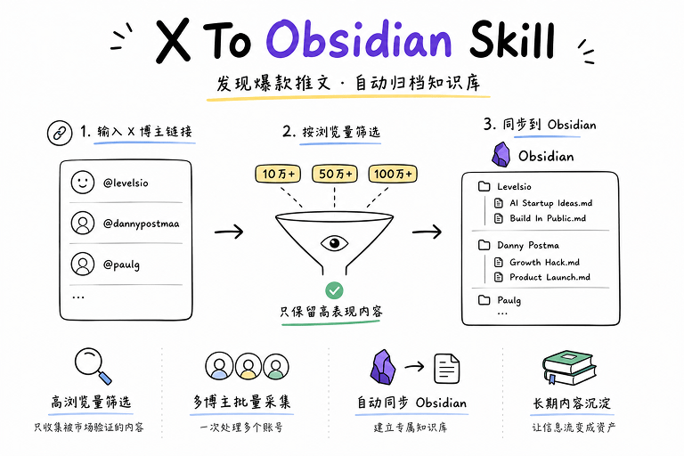
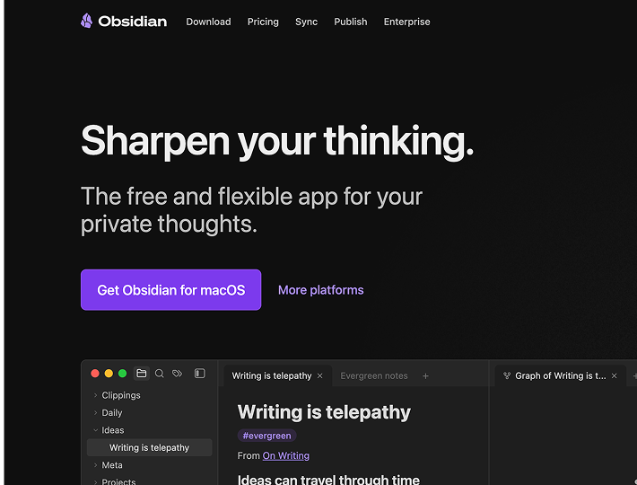
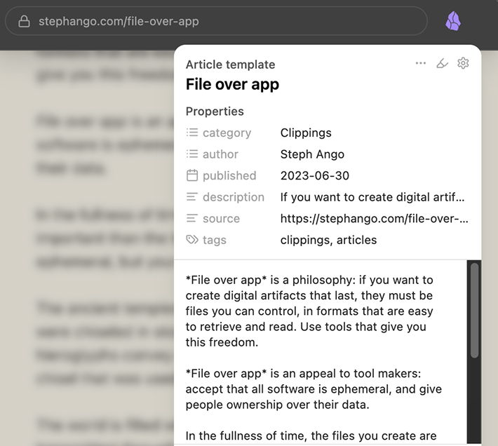

# X To Obsidian Skill

> 发现爆款推文 · 自动归档知识库

自动筛选高浏览量 X（Twitter）推文，并通过官方 Obsidian Web Clipper 一键同步到你的 Obsidian 知识库。

专为内容创作者、独立开发者、产品经理、运营人员打造的对标研究工具。



---

## 功能预览

```text
X 博主链接
      ↓
获取推文
      ↓
按浏览量筛选
      ↓
只保留高表现内容
      ↓
Obsidian Web Clipper
      ↓
自动保存到 Obsidian
      ↓
长期知识沉淀
```

---

## 为什么做这个 Skill

很多人每天收藏大量推文：

* 爆款推文
* AI案例
* 创业经验
* 增长技巧
* 产品思考

但真正需要的时候：

* 找不到
* 没分类
* 没整理
* 无法复盘

这个 Skill 的目标不是帮你收藏推文。

而是帮助你：

**发现高价值内容 → 自动归档 → 建立长期知识资产。**

---

# 前置要求

⚠️ 本 Skill 依赖官方 Obsidian Web Clipper。

未安装 Web Clipper 时无法正常运行。

---

## 1. 安装 Obsidian

下载地址：

https://obsidian.md

安装后创建或打开一个 Vault。



---

## 2. 安装官方 Obsidian Web Clipper

安装地址：

https://obsidian.md/clipper



支持：

* Chrome
* Edge
* Brave
* Arc
* Dia
* Chromium 系浏览器

安装完成后请确认：

* 插件已启用
* 可以正常保存网页
* Obsidian 已启动

---

## 3. 登录 X（Twitter）

确保浏览器已登录 X 账号。

Skill 会读取当前浏览器登录状态获取推文信息。

---

## 4. 打开目标 Obsidian Vault

运行 Skill 前请确保：

```text
Obsidian 已启动

目标 Vault 已打开
```

这样 Web Clipper 才能自动保存内容。

---

# 核心能力

## 高浏览量筛选

支持按照浏览量过滤：

```text
10万+
20万+
50万+
100万+
```

只保留真正被市场验证过的内容。

避免收集低价值推文。

---

## 多博主批量采集

支持同时处理多个账号：

```text
https://x.com/levelsio

https://x.com/dannypostmaa

https://x.com/paulg
```

一次建立完整行业素材库。

---

## 自动同步到 Obsidian

自动调用官方 Web Clipper：

```text
推文
 ↓
Web Clipper
 ↓
Markdown
 ↓
Obsidian
```

无需手动复制粘贴。

---

## 自动整理目录

自动创建：

```text
📁 Levelsio
 ├ AI Startup Ideas.md
 ├ Build In Public.md

📁 Danny Postma
 ├ Growth Hack.md
 ├ Product Launch.md
```

方便长期管理。

---

## 自动附加元数据

每篇笔记自动记录：

```yaml
tweet_id:
views:
likes:
retweets:
author:
handle:
publish_time:
tweet_url:
```

方便后续检索和分析。

---

## 长期知识沉淀

最终形成：

```text
Obsidian

├ AI
├ SaaS
├ Startup
├ Marketing
├ Growth
└ Indie Hacker
```

把信息流变成资产。

---

# 使用方式

## 单个博主

```text
抓取这个博主最近浏览量超过10万的推文

https://x.com/levelsio
```

---

## 指定保存数量

```text
抓取这个博主浏览量超过10万的推文

保存前20篇
```

---

## 多个博主

```text
抓取以下博主

https://x.com/levelsio

https://x.com/dannypostmaa

https://x.com/paulg

保存浏览量超过20万的内容
```

---

## 建立行业知识库

```text
抓取这些 AI 博主

保存浏览量超过50万的内容

同步到 Obsidian
```

---

# 适合谁

### 内容创作者

* 研究爆款选题
* 分析内容结构
* 拆解表达方式
* 积累创作灵感

---

### 独立开发者

* 研究产品发布
* 分析增长案例
* 收集创业经验
* 跟踪行业趋势

---

### AI 创业者

* 跟踪头部 AI 博主
* 收集产品案例
* 建立研究数据库
* 沉淀市场认知

---

### 产品经理

* 收集产品观点
* 跟踪行业变化
* 建立知识体系

---

### 增长运营

* 建立竞品内容库
* 分析高互动内容
* 研究传播规律

---

# 工作原理

```text
输入博主链接
      ↓
获取推文列表
      ↓
按浏览量筛选
      ↓
排序高表现内容
      ↓
打开推文页面
      ↓
调用 Obsidian Web Clipper
      ↓
保存 Markdown
      ↓
归档到知识库
```

---

# 示例

### AI 博主研究

```text
抓取以下博主

https://x.com/sama

https://x.com/levelsio

浏览量超过50万

保存到 Obsidian
```

---

### Startup 对标库

```text
建立 Startup 素材库

抓取浏览量超过20万的内容

自动同步到 Obsidian
```

---

### Build In Public 研究

```text
抓取 Levelsio 最近一年

浏览量超过10万的推文

保存前30篇
```

---

# 注意事项

* 必须安装官方 Obsidian Web Clipper
* 必须打开 Obsidian
* 必须打开目标 Vault
* 必须登录 X（Twitter）
* 当前版本主要支持 Chromium 系浏览器
* 推荐使用 Dia 浏览器

---

# License

MIT
